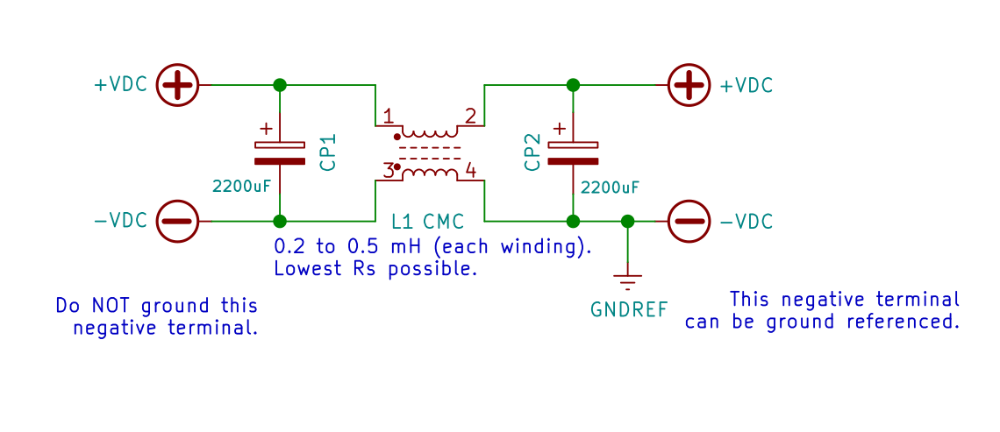
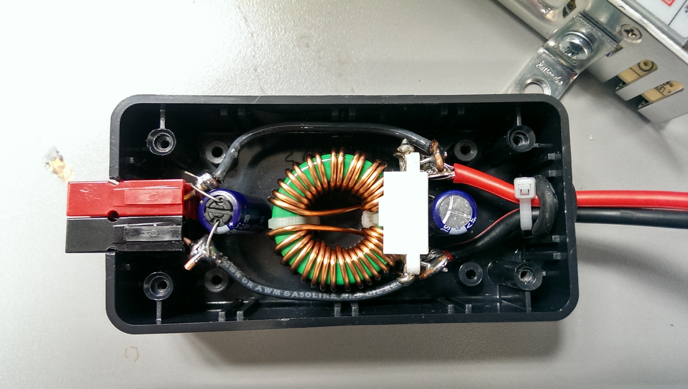
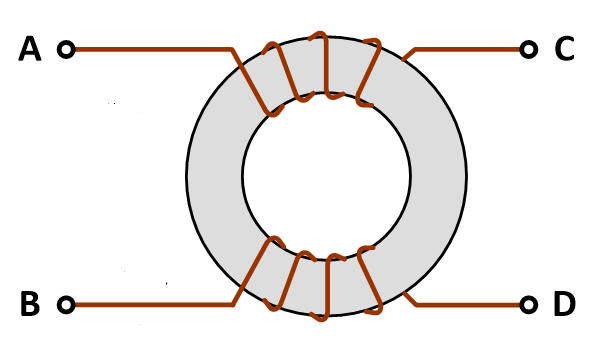
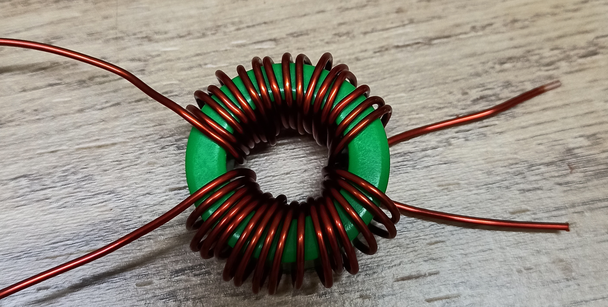
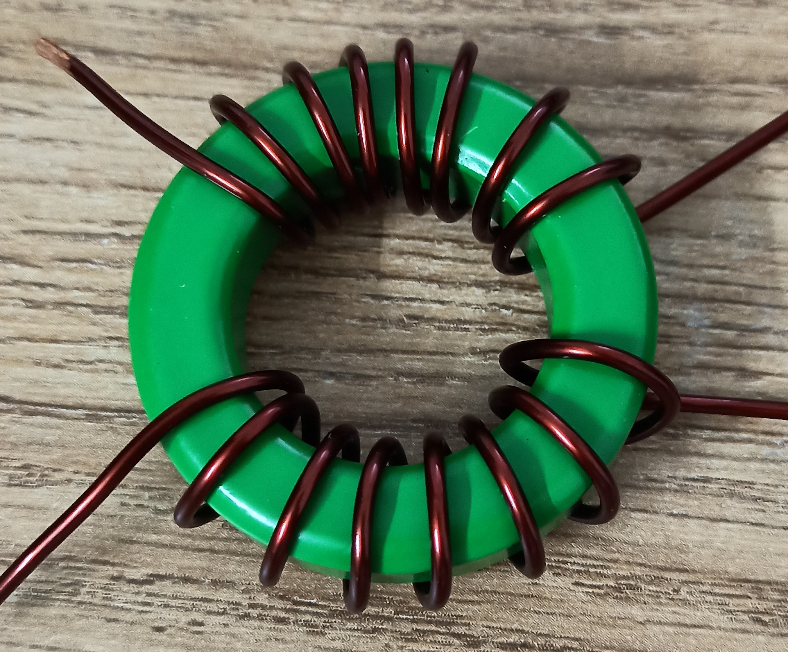

#### DC-side SMPS noise filter from Megas3300

Note: See `SMPS-Output-Filter.pdf` for details.

Note 2: See [simulations folder](./simulations) for LTspice based simulation
results.

#### Notes

This is an amateur design for amateur radio purposes. It is not intended to
replace industrial, professional EMI filters designs meant for non-amateur-radio
purposes. This being said, this design will give professional filters a run for
their money for `value/money` (VFM) and `performance/USD` parameters for some
limited, non-professional use cases (e.g. amateur radio).

For input-side AC line filtering, the commercial filters have low cost (1.5 USD
or less), and are easily available from professional brands (Schaffner, Delta,
Elcom). So I don't recommend homebrewing them (homebrewing may be more
expensive!). The case is opposite for output DC-side filtering. I haven't seen
25A 13.8v DC side filters available for 4 USD (for example). This market
situation provides the motivation for this project to exist ;)

The idea behind making these (and my other) design notes publicly available is
to deliver REPRODUCIBLE, flexible, home-brewable, standardized, reasonable, and
cost-effective solutions for some common problems. I include many references,
simulations, and notes in my projects to enable you to do your own (better)
designs - do share them ;)

#### Winding Pattern

#### DIY QRP (3A+) 3.3 mH CMC From Dhiru - August 2021

This was used to build a clean, light, reasonable, and portable power supply
for IC-705. This power supply is used when IC-705 is operated from remote base
locations.

I love my 40A and 5A linears but I can't carry them around ;)

BOM for 13.8v 3A+ CLC filter (CMC with two 2200uF LESR caps):

- Toroid-T31 - 31mm Toroid Magnetic Ferrite Core - Green (Mahindra CIE, Project
  Point). Toroid-T36, and larger sizes can also be used if space is available.

- Magnetic winding wire - SWG 18 (rated 3.2A) or thicker

- CMC value (each winding) can be between 2.2mH to 3.3mH

  Use 16 turns for each winding

- Omron S8FS-C05012 (preferred) / LRS-50-12 Mean Well (https://www.electronicscomp.com, Vashi Electricals)

- 2 x Bevenbi 2200uF 25v Low ESR electrolytic capacitor (https://diyaudiocart.com, Semikart)

  Alt: Keltron 2200uF >= 25v 'Low ESR (SZ)' Electrolytic Capacitor can be used too (check available space though!)

  Note: The `Low ESR` part is important for this application.

- `Presto Teak PTSB102 7" X 4"` case (35 to 50 INR, local electrical market)

  Online alternate: https://www.probots.co.in/plastic-enclosure-4-x-7.html

- Misc: M3 screws + nuts, Hot glue (not recommended), Use Dowsil 1080 RTV
  ("Silcone Rubber Sealant") / Astral Resibond Clear RTV Silicon Sealant
  (better priced) instead for misc structural support(s) < 50 INR

IMPORTANT: Use only genuine and properly sourced toroids, capacitors, and
SMPS(es) - remember the RIRO principle!

Testing: The RX performance of (on) this power supply design was compared
against a 4S LiFePO4 pack on air using WSJT-X. The RX performance was not
affected at all for the 20m band.

Note: These CMC designs are based on commercial `Würth Elektronik's` CMC
designs. Yes, copy-paste research with independent, and multiple levels
of testing, simulations, and documentation is the most efficient design
approach.

#### DIY QRO (20A+) 0.5 mH CMC From Dhiru - 2021

BOM:

- CF197T4511C ferrite core from Cosmo Ferrites (sourced via IndiaMART -
  Glorious Electronics - Mumbai)

  Mahindra CIE's 45mm and 50mm ferrite cores (via `Project Point`) are also
  fine.

- LRS-350-12 Mean Well SMPS - 12V 29A / LM350-10B12 Mornsun SMPS

- Use the thickest magnetic winding wire you can bend ;)

- 25v Bevenbi Low ESR capacitors are OK for 13.8v.

#### Scaling Up More?

- Want to handle 45A @ 30v?

- For handling 30 VDC (30v), use Keltron 2200uF, 63V 'Low ESR' Electrolytic
  Capacitors.

  https://diyaudiocart.com/Keltron-2200uF-63V-Electrolytic-Capacitor

  Check physical size from the datasheet to be sure though.

- Reverse-engineer (aka 'read datasheets' for) TDK EPCOS B82727E6503A40 CMC
  2x0.57mH 50A model.

  TDK EPCOS `R 63.0 × 38.0 × 25.0` (N87 Grade) looks suitable enough - check
  datasheets / some calculator (?) / do some math to be sure.

  I have the N87 grade `blue` epoxy coated one (AL 5000, µi = 2200) for future
  experiments. Generating, and sinking 45A @ 30v is not trivial though ;)

  [Grade selection URL on Mouser](https://www.mouser.in/c/passive-components/emi-filters-emi-suppression/ferrites/ferrite-cores-accessories/?outside+diameter=63+mm). Don't worry about the Mouser pricing - local prices are way lower ;)

- Ensure proper magnetic winding wire gauge size (wire ampacity is a critical
  factor in scaling up).

#### Related Notes

For AC side EMI filtering, Emitech, Elcom / Delta / Schaffner EMI filters are
available in the local electronics market / IndiaMART / Semikart (on the
expensive side).

- https://www.dnatechindia.com/elcom-emi-12-power-inlet-india.html

#### References

- https://www.cettechnology.com/common-mode-choke-design/

- http://www.djerickson.com/dc-dc/

- https://www.semic.cz/!KATEGORIE/6K/COSMO_EN.pdf (Cosmo Ferrites Product Catalogue)

- https://projectpoint.in/datasheets/pdf/ferrite-core.pdf (Mahindra CIE Product Catalogue)

- https://www.emisindia.com/contact-us/ (another EMI filter vendor, could this
  be price effective for QRO 50A+ requirements!? - from VU2POP)

- [TDK Ferrite Materials - "Grade" information](https://www.tdk-electronics.tdk.com/en/529404/products/product-catalog/ferrites-and-accessories/epcos-ferrites-and-accessories/ferrite-materials)

- [LCR-T4 12864 LCD Graphical Transistor Tester Resistance Capacitance ESR SCR Meter](https://www.techtonics.in/lcr-t4-12864-lcd-graphical-transistor-tester-resistance-capacitance-esr-scr-meter) - useful for measuring inductances among other things

- https://github.com/kholia/Adjustable-Load-v1.1 - super fun, and useful for variable load testing

- [How To Measure Power Supply Ripple & Noise - Differential probing with common oscilloscope setups](https://www.youtube.com/watch?v=Edel3eduRj4)

- http://www.keltroncomp.org/index.php/prdcts/alum-elec-capacitor (Keltron catalogue)

- https://qrpkits.com/wallwarttamer.html
